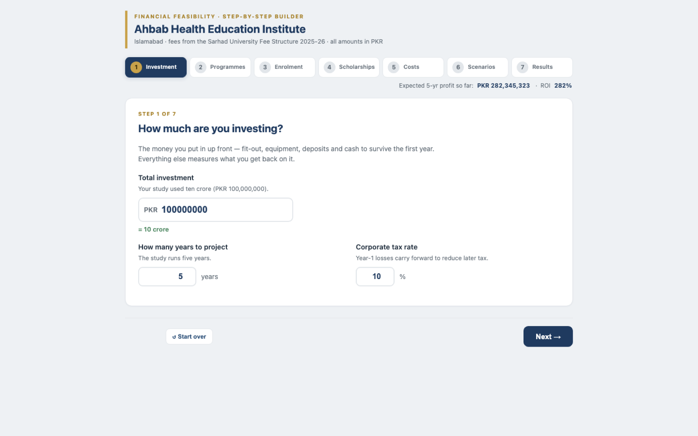
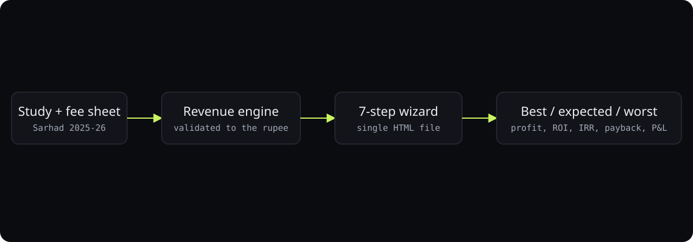

# Ahbab feasibility builder

**A seven-step financial feasibility model for a health-education institute, in one self-contained HTML file.**

 

> **Reproduces the feasibility study to the rupee**  
> for the founders of Ahbab Health Education Institute, Islamabad

## What it did

Investment, 21 programmes with real Sarhad University fees, enrolment by year, scholarships, staffing roster, best and worst scenarios, then profit, ROI, IRR, and payback with a full P&L. No build, no server, works offline.

Outcome: reported by the owner.

## How it works

1. One HTML file so it can be emailed and opened anywhere, including offline.
2. The revenue engine was validated against the source study's student counts and gross fees before any UI work.
3. IRR solved by bisection in a few lines rather than a library.
4. Three scenarios computed from one set of inputs plus income and cost swings.

## What it does

A single, self-contained HTML file (no build, no dependencies, works offline). A 7-step wizard:

1. **Investment** — amount, projection horizon, tax rate
2. **Programmes** — tick any of the 21 Sarhad programmes in/out; fees pull automatically
3. **Enrolment** — new students per programme, per year (programmes can start in later years)
4. **Scholarships** — male / female discount and coverage, per programme, per year
5. **Costs** — a staffing roster (role × monthly salary × headcount per year) plus an
   add/remove list of any other cost line
6. **Scenarios** — the best / worst income and cost swing
7. **Results** — Best / Expected / Worst feasibility: profit, ROI, IRR, payback, full P&L, charts

## Running locally

Just open `Ahbab-Feasibility-Dashboard.html` in any browser. No server required.

## Notes

The revenue engine reproduces the source study's student counts and gross fees to the rupee.
A planning model — not a substitute for professional accounting or legal advice.
All amounts in PKR.

---

Built by <a href="https://github.com/ibi-raheel">Muhammad Ibrahim Raheel</a> · more work at <a href="https://ibiraheel.com">ibiraheel.com</a>

